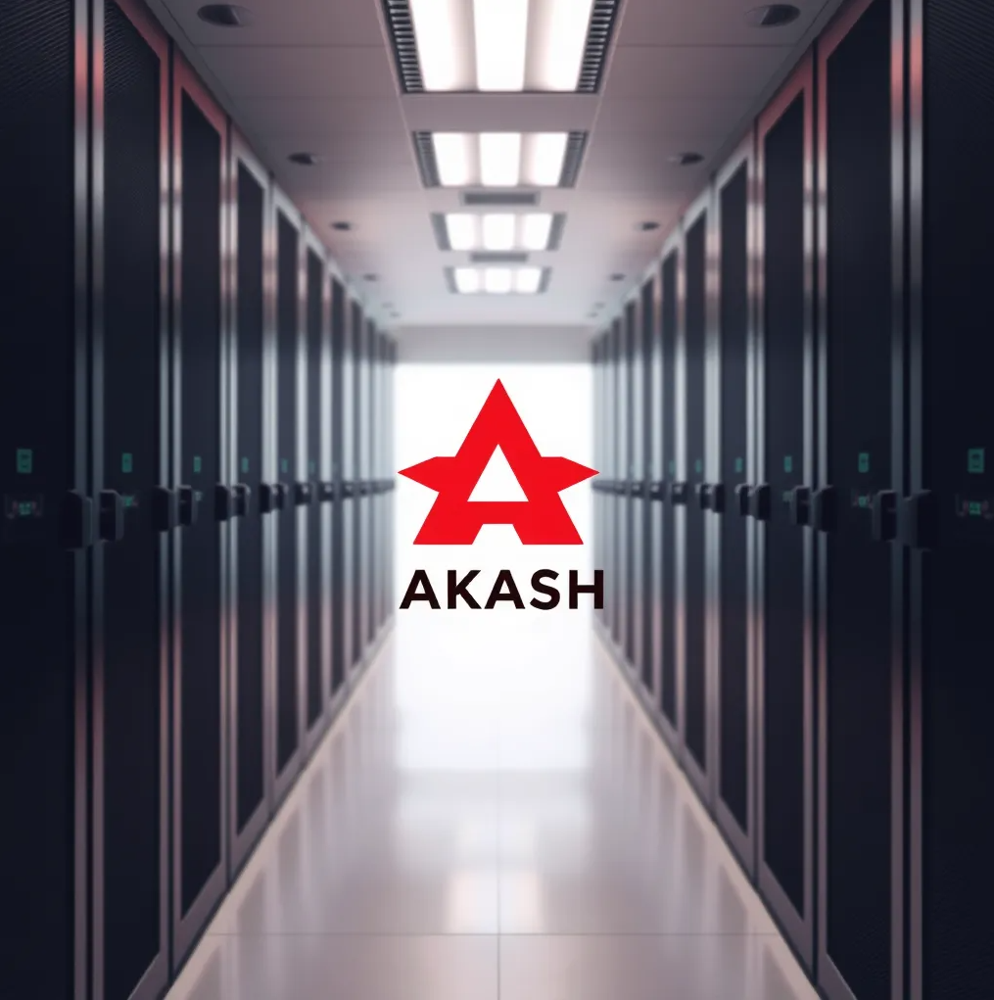
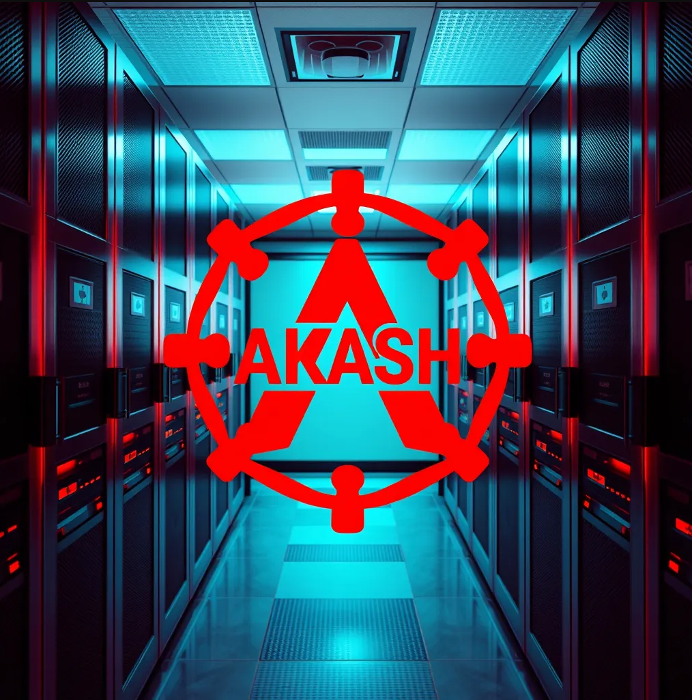
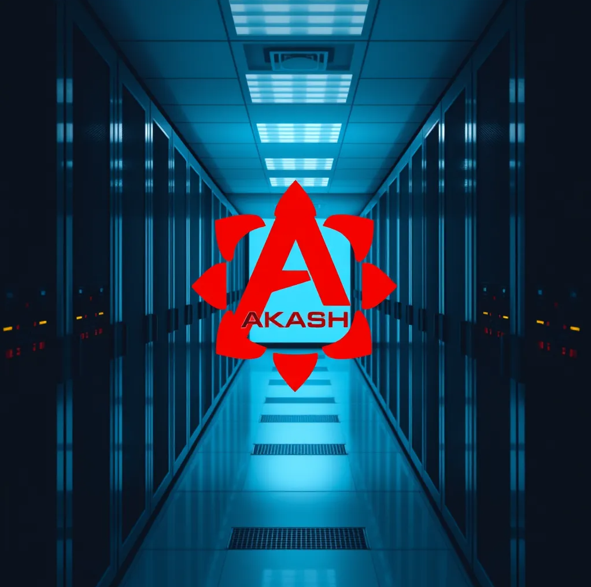

# Text to Image on Akash Network

Text-to-image app powerered by [black-forest-labs /FLUX.1-schnell](https://huggingface.co/black-forest-labs/FLUX.1-schnell).

The project is developed for the **Flux-schnell model on Akash** zealy task which is hosted by [Akash](https://zealy.io/cw/akashnetwork/questboard).

Insead of using the [replicate](https://replicate.com/black-forest-labs/flux-schnell/api) api this project hosts the model from hugging face directly.

## Deploy on Akash guide 

https://github.com/user-attachments/assets/744a7ec4-a42b-44ea-8163-a613638cc6d9

- Create and fund a Keplr or Leap wallet
  - [Keplr wallet](https://akash.network/docs/getting-started/token-and-wallets/#keplr-wallet)
  - [Leap wallet](https://akash.network/docs/getting-started/token-and-wallets/#leap-cosmos-wallet)
- Visit https://deploy.cloudmos.io/
- Connect your wallet
  - You need to have at least 0.5 AKT in your wallet
- Press the deploy button
- Select "Build your template"
- (Optional) Name your deployment
- Select YAML and paste the [deploy.yaml](deploy.yaml) contents
- Press "Create Deployment"
- Accept wallet transaction
- Review bids and select provider
- Accept provider transaction
- Go to LEASES and press the URI
- Check the [Akash docs](https://akash.network/docs/deployments/cloudmos-deploy/) if you have and questions
- Start generating images!

## Example

`prompt: A server room and a red logo with the word "AKASH" in the center`

<table>
  <tr>
    <td>Result 1</td>
     <td>Result 2</td>
     <td>Result 3</td>
  </tr>
  <tr>
    <td></td>
    <td></td>
    <td></td>
  </tr>
 </table>
